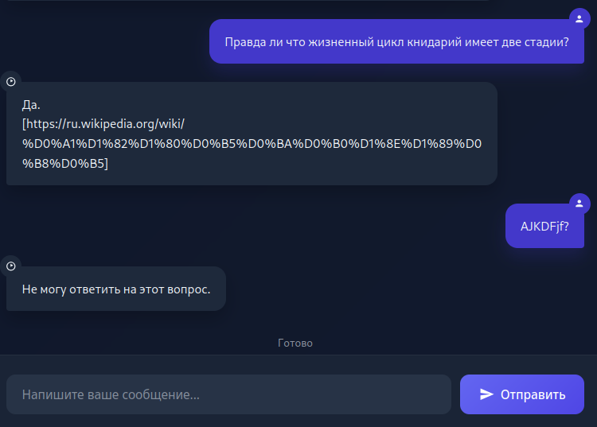
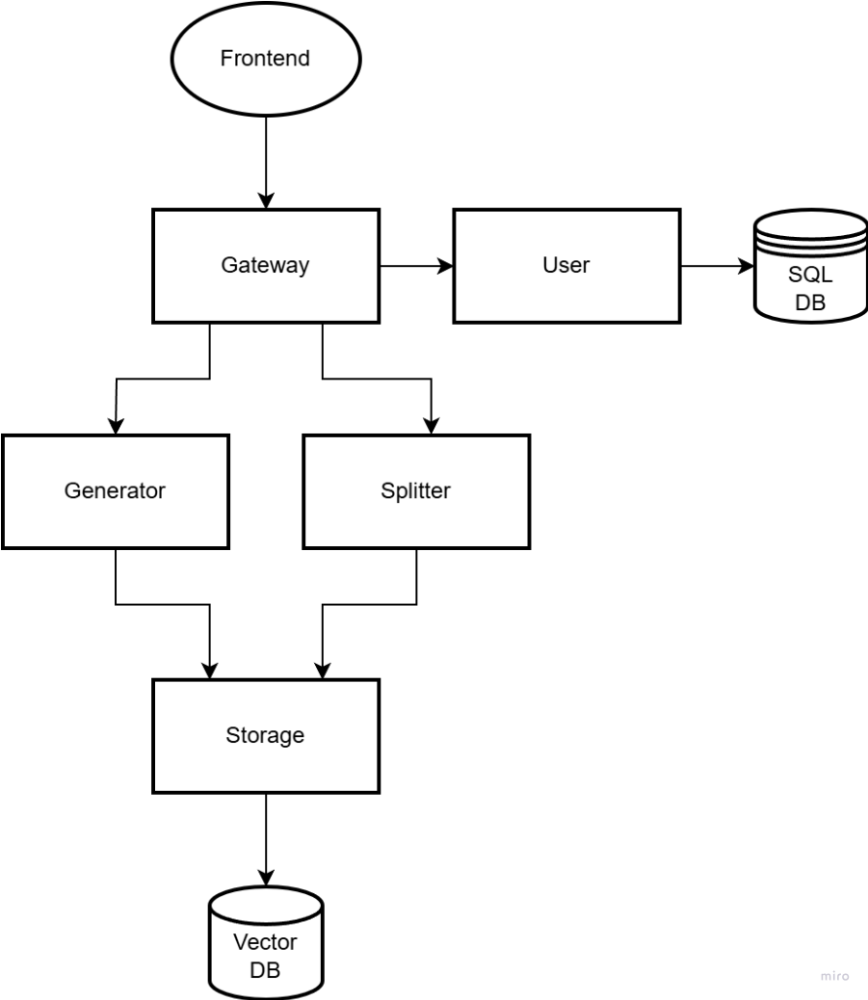
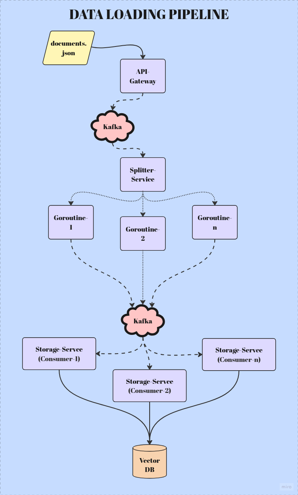
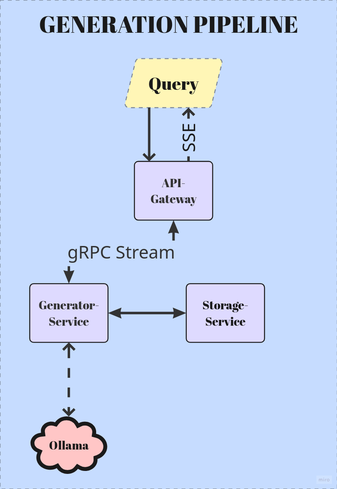

<div align="center">
  
</div>

<h1 align="center">🧠 RAGO — Распределённая RAG-платформа на Go</h1>

<p align="center" style="color: #666;">
  <em>Спроектированная для высокой производительности и масштабирования. Использует Apache Kafka для обработки больших объёмов документов, Ollama для локального, быстрого взаимодействия с LLM, Qdrant для возможности гибкого масштабирования векторного хранилища и Prometheus+Grafana для метрик и их визуализации.</em>
</p>

--- 
> **🚀 Key Features**  
> - Загрузка и индексация документов в векторное хранилище  
> - Генерация ответов с использованием LLM (Ollama)  
> - Персональные коллекции для каждого пользователя  
> - Мониторинг через Prometheus + Grafana  
> - Обработка больших объемов через Apache Kafka  
---

### ⚠️ ВНИМАНИЕ: На текущий момент это по большей части учебный проект, не готовый к продакшену. Возможно, это будет исправлено в будущем.

## ⚙️ Минимальные требования

| Ресурс          | Требование       |
|-----------------|------------------|
| **RAM**         | 8 GB             |
| **Диск**        | 4 GB             |
| **Процессор**   | x86-64           |


## 📖 Оглавление
- [🚀 **Быстрый старт**](https://github.com/child6yo/rago/edit/main/README.md#-%D0%B1%D1%8B%D1%81%D1%82%D1%80%D1%8B%D0%B9-%D1%81%D1%82%D0%B0%D1%80%D1%82)
- [🎮 **Пример работы**](#-пример-работы)
- [🏗 **Архитектура**](#-архитектура)
- [📚 **API Документация**](api-gateway\docs\API_REF.md)


## 🚀 Быстрый старт 

### Запуск
#### Makefile
```
make build
make run
```
#### Docker Compose
```
docker-compose up -d --build
```

### После запуска
После того, как приложение было запущено, необходимо какое-то время на инициализацию отдельных сервисов (от 3-х до 10 минут). В первую очередь это связано с тем, что Ollama загружает языковые модели.

Далее Web-API приложения будет доступно по адресу **localhost:8080**. [**API Reference (WIP)**](api-gateway/docs/openapi.yaml).

Для базового теста работоспособности необходимо:
 - зарегестрироваться
 - создать API-ключ
 - имея API-ключ загрузить данные через [скрипт](examples/load_data/load_data.py)

Тестовый пользовательский UI для генерации на основе документов доступен по адресу **localhost:80**.

## 🎮 Пример работы

### Генерация происходит токен за токеном, как и на всех LLM-клиентах.



## 🏗 Архитектура

### Основные компоненты

#### API Gateway
- **Назначение**: Единая точка входа для всех внешних запросов
- **Технологии**: Gin, Prometheus (метрики HTTP-запросов)
- **Функции**:
  - Маршрутизация RESTful запросов
  - **Мониторинг**: Сбор метрик HTTP-соединений.

#### User Service
- **Назначение**: Управление пользователями и доступом
- **Функции**:
  - Регистрация/аутентификация (JWT)
  - Управление API-ключами
  - Организация коллекций документов

#### Generator Service
- **Назначение**: Контекстно-зависимая генерация
- **Интеграции**: 
  - LLM (Ollama с кастомными моделями)
  - Планируется: Prometheus для метрик генерации

#### Splitter Service
- **Назначение**: Обработка массивов документов
- **Особенности**:
  - Пул горутин для параллельной обработки

#### Storage Service
- **Назначение**: Работа с векторными данными
- **Интеграции**:
  - Qdrant (векторное хранилище)
  - Ollama (генерация эмбеддингов)
  - Планируется: Prometheus для метрик запросов
    
### Общая схема связи сервисов



### Пайплайн обработки данных
 1. Прием данных:

        Клиент → API Gateway (REST)
        Валидация и буферизация в Kafka (raw-docs)

2. Разделение документов:

        Splitter Service:
         - потребляет из raw-docs
         - Параллельная обработка (worker pool), разделяет массив на отдельные  документы
         - Отправка в document-topic (будет переименовано в processed-docs)

3. Индексация:

        Storage Service:
          - Генерация эмбеддингов
          - Сохранение в Qdrant

### Схема пайплайна загрузки документов



### Пайплайн генерации
 1. Прием данных:

        Клиент → API Gateway (REST)

2. Инициализация генерации:

        Generation Service:
         - отправляет запрос в Storage Service на векторный поиск по данным пользователя
         - в случае успеха открывает gRPC-поток с API Gateway.

3. Генерация:

        - использует данные из векторного хранилища как контекст, на основе него формирует промпт
        - отправляет запрос в ollama через langchaingo, начинает генерацию токенов
        - транслирует токены через gRPC поток на API Gateway
        - API Gateway транслирует поток клиенту через SSE соединение.

### Схема пайплайна генерации

