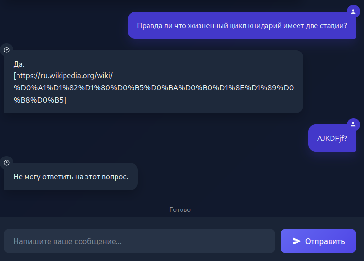
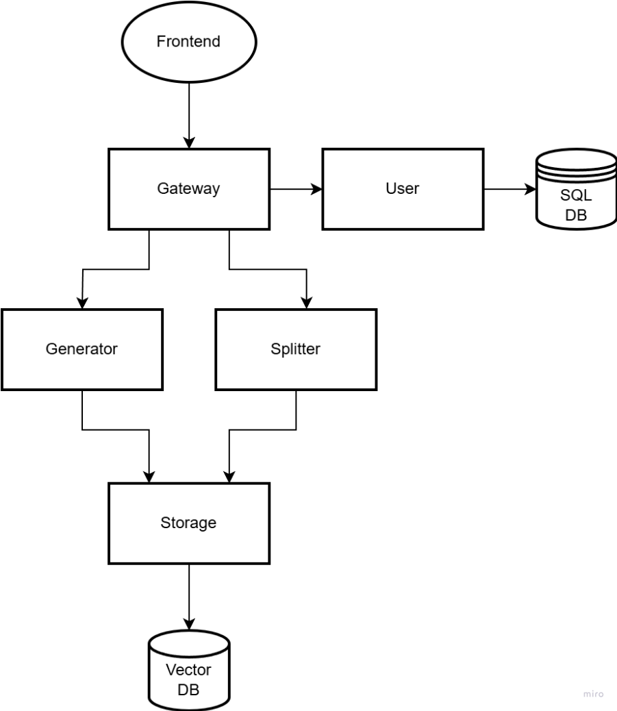
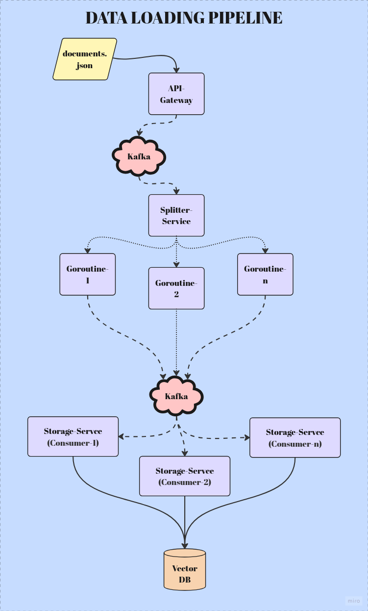

<div style="display: flex; align-items: center; gap: 20px;">
  
  <div>
    <h1 style="margin: 0;">🧠 RAGO — Distributed RAG Platform in Go</h1>
    <p style="margin: 5px 0 0 0; color: #666;"><em> Designed for high performance and scalability. Uses Apache Kafka for processing large volumes of documents, Ollama for fast local LLM interaction, Qdrant for flexible vector storage scaling, and Prometheus + Grafana for metrics and visualization.</em></p>
  </div>
</div>

---

> **🚀 Key Features**  
> - Upload and index documents into a vector store  
> - Generate answers using LLM (Ollama)  
> - Personal collections for each user  
> - Monitoring with Prometheus + Grafana  
> - Process large volumes via Apache Kafka  

---

### ⚠️ NOTE:  This is currently mostly an educational project and is not production-ready. This may be improved in the future.

## ⚙️ Minimum Requirements

| Resource     | Requirement       |
|--------------|-------------------|
| **RAM**      | 8 GB              |
| **Disk**     | 4 GB              |
| **CPU**      | x86-64 (AVX)      |

## 📖 Table of Contents
- [🚀 **Quick Start**](#-quick-start)
- [🎮 **Usage Example**](#-usage-example)
- [🏗 **Architecture**](#-architecture)
- [📚 **API Documentation**](api-gateway/docs/API_REF.md)

---

## 🚀 Quick Start

### Running the Application

#### Using Makefile:
```bash
make build
make run
```
#### Using Docker Compose
```
docker-compose up -d --build
```

### After Launch

Once the application is running, it may take some time to initialize individual services (from 3 to 10 minutes), primarily due to Ollama downloading language models.

The Web API will then be available at **localhost:8080**. [**API Reference**](api-gateway/docs/API_REF.md).

To perform a basic functionality test:
- Register an account
- Create an API key
- Use the API key to upload data via the provided [script](examples/load_data/load_data.py)

A simple web UI for document-based generation is available at **localhost:80**.

---

## 🎮 Usage Example

### Token-by-Token Generation

Generation works token by token, just like on standard LLM clients.



---

## 🏗 Architecture

### Core Components

#### API Gateway
- **Purpose**: Single entry point for all external requests
- **Technologies**: Gin, Prometheus (for HTTP request metrics)
- **Features**:
  - RESTful request routing
  - **Monitoring**: Collection of HTTP connection metrics

#### User Service
- **Purpose**: Manage users and access
- **Features**:
  - Registration/authentication (JWT)
  - API key management
  - Organization of document collections

#### Generator Service
- **Purpose**: Context-aware generation
- **Integrations**:
  - LLM (Ollama with custom models)
  - Planned: Prometheus for generation metrics

#### Splitter Service
- **Purpose**: Processing document arrays
- **Features**:
  - Goroutine pool for parallel processing

#### Storage Service
- **Purpose**: Work with vector data
- **Integrations**:
  - Qdrant (vector database)
  - Ollama (embedding generation)
  - Planned: Prometheus for query metrics

---

### Service Interaction Diagram



---

### Data Ingestion Pipeline

1. **Receiving Data**:

        Client → API Gateway (REST)
        Validation and buffering in Kafka (raw-docs)

2. **Document Splitting**:

        Splitter Service:
         - Consumes from raw-docs
         - Parallel processing (worker pool), splits array into individual documents
         - Sends to document-topic (will be renamed to processed-docs)

3. **Indexing**:

        Storage Service:
          - Generates embeddings
          - Stores in Qdrant

### Document Upload Pipeline Diagram



---

### Generation Pipeline

1. **Receiving Query**:

        Client → API Gateway (REST)

2. **Initialization**:

        Generation Service:
         - Sends request to Storage Service for vector search based on user data
         - Opens gRPC stream to API Gateway upon success

3. **Generation**:

        - Uses data from the vector store as context to form a prompt
        - Sends request to Ollama via langchaingo, starts token generation
        - Streams tokens via gRPC to API Gateway
        - API Gateway relays the stream to the client via SSE

### Generation Pipeline Diagram


